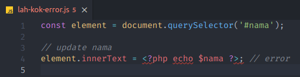
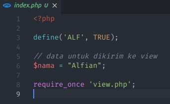
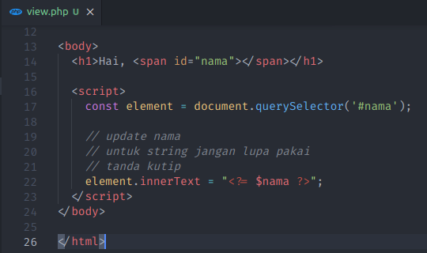
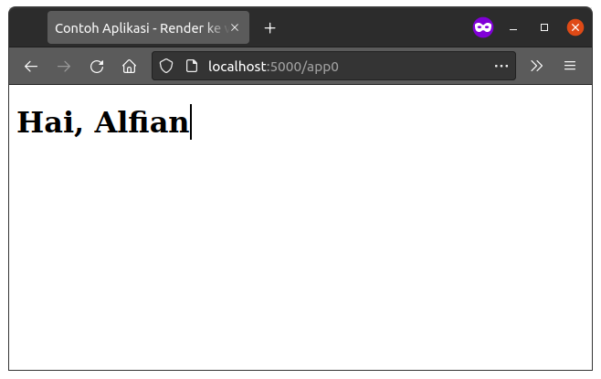
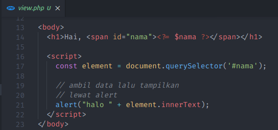
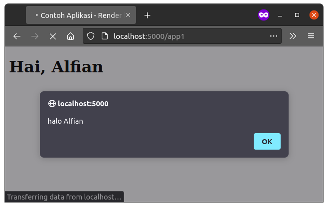
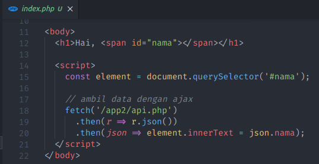
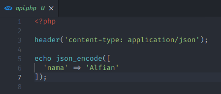

# Blog PHP Data Dari Backend

## Coba langsung

- Download atau clone repo ini
- Buka di terminal lalu ketik `php -S localhost:5000 -t app`
- Buka `http://localhost:5000` di browser

## Presentasi

### Slide 1

Lah kok gak bisa? 😵

Eitss tenang, kali ini saya akan membagikan cara memanggil data dari backend ke javascript (frontend)

### Slide 2

#### Cara pertama

Render ke variabel javascript

Hasilnya

### Slide 3

#### Cara kedua

Render ke element HTML

Hasilnya

### Slide 4

#### Cara ketiga

Dengan AJAX

Hasilnya

## Informasi

Dapatkan source code di [suka.page.link/x0](https://suka.page.link/x0)

Ingin membuat aplikasi berbasis website? silahkan kontak saya di [suka.page.link/wa](https://suka.page.link/wa)

## Penutup

Demikian tutorial dari saya, semoga bermanfaat
